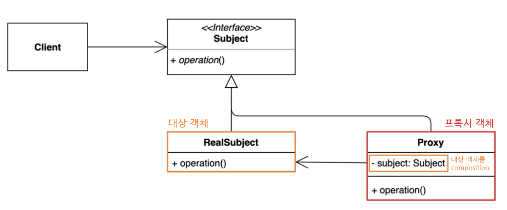

# 프록시 패턴
대상 원본 객체를 대리하여 대신 처리하게 함으로써 **로직의 흐름을 제어**

## 사용 효과
* 보안(Security): 프록시는 클라이언트가 작업을 수행할 수 있는 권한이 있는지 확인하고 검사 결과가 긍정적인 경우에만 요청을 대상으로 전달한다.
* 캐싱(Caching): 프록시가 내부 캐시를 유지하여 데이터가 캐시에 아직 존재하지 않는 경우에만 대상에서 작업이 실행되도록 한다.
* 데이터 유효성 검사(Data validation): 프록시가 입력을 대상으로 전달하기 전에 유효성을 검사한다.
* 지연 초기화(Lazy initialization): 대상의 생성 비용이 비싸다면 프록시는 그것을 필요로 할때까지 연기할 수 있다.
  * JPA 프록시
* 로깅(Logging): 프록시는 메소드 호출과 상대 매개 변수를 인터셉트하고 이를 기록한다.
* 원격 객체(Remote objects): 프록시는 원격 위치에 있는 객체를 가져와서 로컬처럼 보이게 할 수 있다.

## 패턴 사용 시기

* 접근을 제어하거가 기능을 추가하고 싶은데, 기존의 특정 객체를 수정할 수 없는 상황일때
* 초기화 지연, 접근 제어, 로깅, 캐싱 등, 기존 객체 동작에 수정 없이 가미하고 싶을 때

## 패턴 단점
* 많은 프록시 클래스를 도입으로 인한 코드의 복잡도가 증가
* JDK 동적 프록시 기법을 이용해서 해결 가능
* 프록시 클래스 자체에 들어가는 자원이 많다면 성능 이슈 가능성 존재