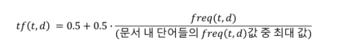
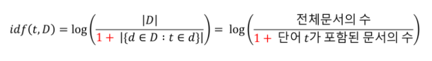
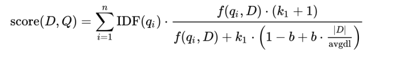

# 유사도 측정 알고리즘
단어를 기반으로 유사도 점수를 측정하는 알고리즘에 대해 알아본다.

## TF/IDF
유사도 스코어를 TF * IDF 로 계산한다
### TF(Term Frequency)

* 한 문서내 특정 단어의 빈도수
### IDF(Inverse Document Frequency)

* 전체 문서내 특정 단어의 빈도수의 역수
* 전체 문서 내에서 빈도수가 높으면 불용어일 확률이 높기 때문이다
* 문서수 N이 커질수록 IDF가 커지기 때문에 로그 처리를 해준다

## BM25

* TF/IDF 를 개선한 알고리즘
* 기존의 스코어 알고리즘에서 가중치를 가해줘서 정확도를 높였다

### 장점
* TF의 영향이 줄어든다 -> TF가 일정 수준을 넘어가면 가중치가 일정값으로 수렴한다
* DF의 영향이 커진다 -> 불용어가 검색 점수에 영향을 덜 미친다.
* 문서 길이의 영향이 줄어든다 -> 문서 길이를 검색에 사용한다.

